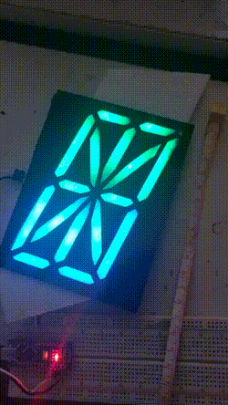
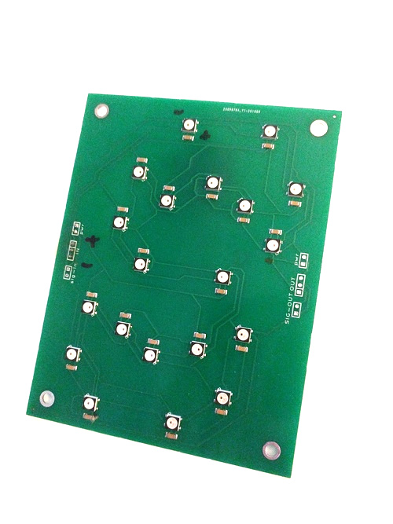
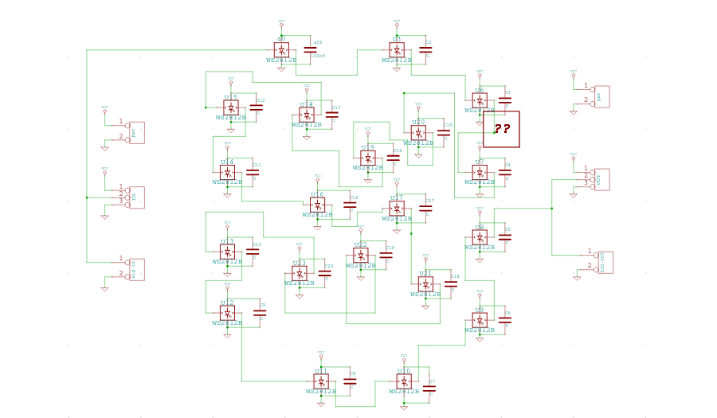
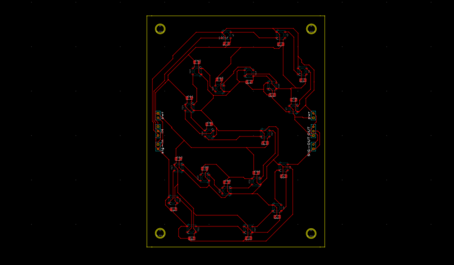
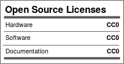

seglow16
---

A 16 segment digit (base board) using WS2812B/SK6812 5050 parts.
Size should be about 5.2"x3.9" (132mmx100mm).

Currently this project is **semitested**.

Made with [MeowCAD](https://meowcad.com/project?projectId=4983569d-bf97-47ea-8737-0bbebbcf3797).

| | |
|---|---|
|  |  |

---

The order of the LEDs is given by the following diagram:

License
---

Everything in this directory, unless explicitly denoted otherwise, is
under a CC0 license.

CC0

