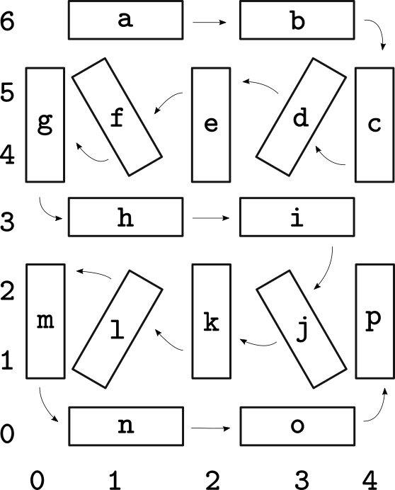

seglow16
---

A 16 segment digit (base board) using WS2812B/SK6812 5050 parts.
Size should be about 5.2"x3.9" (132mmx100mm).

The segments can be chained, just like a normal WS2812b strip,
and each board has separate power and signal lines to facilitate
ease of driving multiple digits chained together.

A small example script to "drive" the digits is located in the
[`src/` directory](https://github.com/abetusk/seglow16/blob/main/src/seglow16-example.ino).

---

Made with [MeowCAD](https://meowcad.com/project?projectId=4983569d-bf97-47ea-8737-0bbebbcf3797).

| | |
|---|---|
|  |  |

The current version is located in `export_v0.1.1`.

A skinnier version of the digit is located in `export_v0.2.0` but this hasn't been tested.

---

The order of the LEDs is given by the following diagram:

---

For creating dividers for separating the segments or for creating the digit masks,
the SVG files can be used, located in the [`aux/` directory](https://github.com/abetusk/seglow16/blob/main/aux).

Fabrication
---

The current version is located in the [export_v0.1.1](https://github.com/abetusk/seglow16/blob/main/export_v0.1.1/gerber/seg16_v0.1.1.zip)
directory.

If you would like to use JLCPCB's service to fab boards, the BOM and CPL file are located in
the [`aux/jlcpcb` directory](https://github.com/abetusk/seglow16/blob/main/aux/jlcpcb).

License
---

Everything in this directory, unless explicitly denoted otherwise, is
under a CC0 license.

CC0

